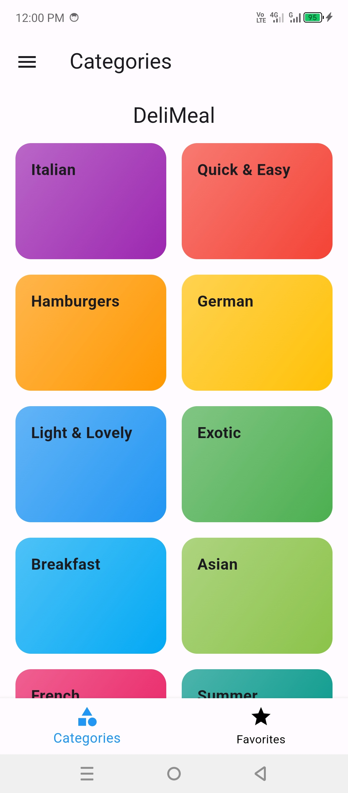
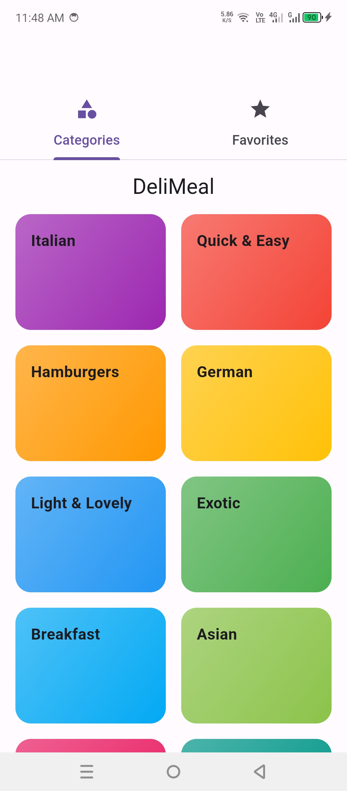
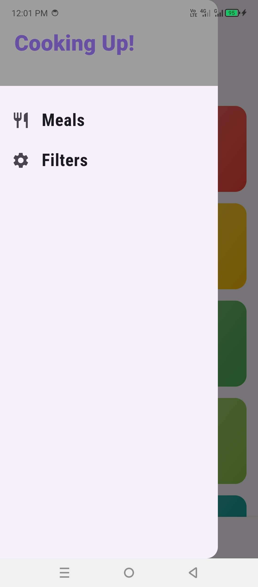
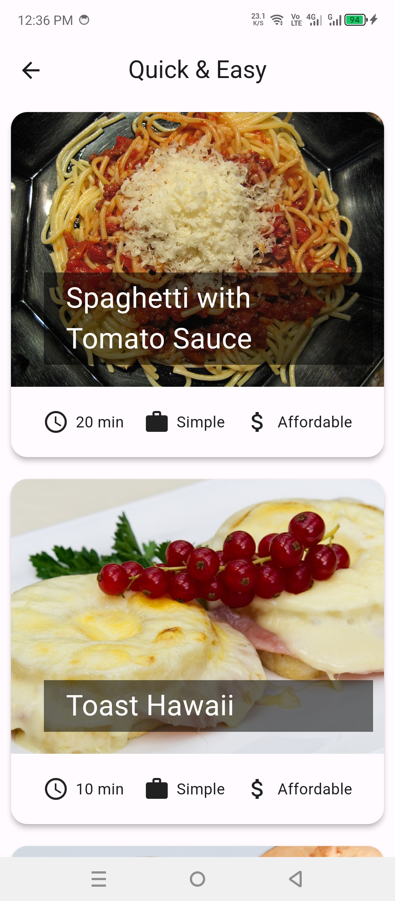

# meals_app

A new Flutter project.

## Getting Started

Inside this project the screens are divided into sub small screens to make code cleaner
create separate screen for Drawer 
create separate screen for Tabs

## Screenshots

Below are Some Screenshots of the App

### Screen1
])

### Screen2
])

### Screen3
])

### Screen4
])
